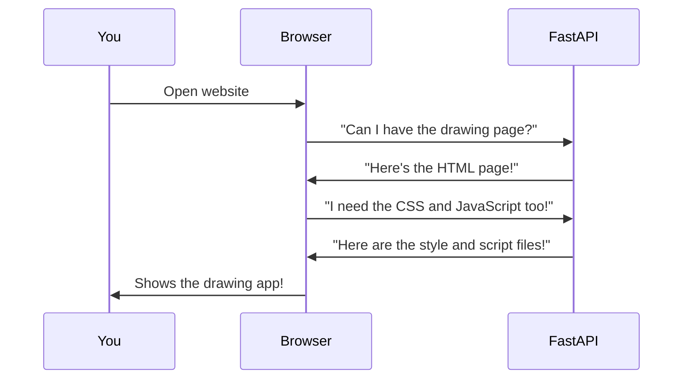

# FASTAPI Drawing App - README

## 🌟 What is This Project?

This is a fun drawing website where you can:
- Draw pictures with different colors 🎨
- Change the brush size (make it bigger or smaller) ✏️
- Clear your drawing and start over 🧹

It's like a digital version of paper and crayons, but on your computer!

## 🧩 How It Works (Simple Explanation)

Imagine you have:
1. A magic whiteboard (that's the big white area where you draw)
2. Some buttons to change colors and brush sizes
3. A special eraser to clean everything

When you move your mouse while holding the button down, it draws lines! The computer remembers where your mouse goes and connects the dots to make your drawing.

## 🏗️ Project Structure

Here's what all the files do:

```
03_FASTAPI_TEMPLATE/
├── static/            # All the "decorations" for the website
│   ├── script.js      # The brain that makes drawing work
│   └── styles.css     # Makes everything look pretty
├── templates/         # The pages of our website
│   ├── index.html     # Main drawing page
│   └── about.html     # Information about the project
├── main.py            # The boss that runs the whole website
├── pyproject.toml     # List of ingredients needed
└── README.md          # This instruction manual!
```

## 🖥️ How the Computer Parts Talk to Each Other



1. You type the website address
2. FastAPI (our website boss) sends the drawing page
3. Your computer asks for the colors and rules (CSS) and the brain (JavaScript)
4. Now you can draw!

## 🚀 How to Make It Even Better

Here are some cool things we could add:

1. **Save Your Art** 💾
   - Add a "Save" button to keep your drawings
   - Let you give your drawing a name

2. **More Tools** 🛠️
   - Add shapes (circles, squares)
   - Different brush styles (like spray paint)

3. **Share With Friends** 📤
   - Let you send your drawing to friends
   - Make a gallery of everyone's drawings

4. **Fun Colors** 🌈
   - Rainbow brush that changes colors as you draw
   - Patterns and stickers

## 🛠️ How to Start the Website

1. Make sure you have Python installed
2. Install FastAPI and Uvicorn:
   ```bash
   pip install fastapi uvicorn
   ```
3. Run the server:
   ```bash
   uvicorn main:app --reload
   ```
4. Open your browser and go to:
   ```
   http://localhost:8000
   ```

## 🤔 Why This is Cool

This project shows how:
- FastAPI can quickly make websites
- JavaScript makes web pages interactive
- HTML/CSS make things look nice
- All these parts work together to make something fun!

Now go ahead and make some awesome drawings! 🎨✨